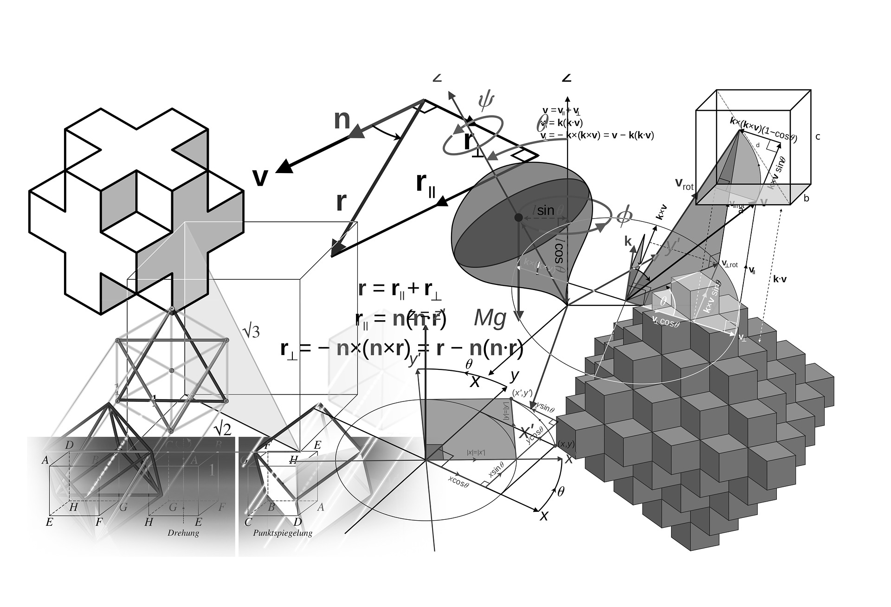

<!--
*** Thanks for checking out the Best-README-Template. If you have a suggestion
*** that would make this better, please fork the repo and create a pull request
*** or simply open an issue with the tag "enhancement".
*** Don't forget to give the project a star!
*** Thanks again! Now go create something AMAZING! :D
-->

<!-- PROJECT SHIELDS -->
<!--
*** I'm using markdown "reference style" links for readability.
*** Reference links are enclosed in brackets [ ] instead of parentheses ( ).
*** See the bottom of this document for the declaration of the reference variables
*** for contributors-url, forks-url, etc. This is an optional, concise syntax you may use.
*** https://www.markdownguide.org/basic-syntax/#reference-style-links
-->
[![Contributors][contributors-shield]][contributors-url]
[![Forks][forks-shield]][forks-url]
[![Stargazers][stars-shield]][stars-url]
[![Downloads][downloads-shield]][downloads-url]
[![CC BY 4.0][license-shield]][license-url]

<!-- PROJECT LOGO -->
 

    
  </a>

  <h3 align="center">FurtherQ Problem Sets</h3>

  

    An awesome README template to jumpstart your projects!
     
    <a href="https://github.com/NousernameSG/FurtherQ-Problem-Sets/issues">Report Bug</a>
    ·
    <a href="https://github.com/NousernameSG/FurtherQ-Problem-Sets/issues">Request Feature</a>
  

<!-- TABLE OF CONTENTS -->

  
Table of Contents

  <ol>
    <li>
      <a href="#about-the-project">About The Project</a>
      <ul>
        <li><a href="#built-with">Built With</a></li>
      </ul>
    </li>
    <li><a href="#contributing">Contributing</a></li>
    <li><a href="#license">License</a></li>
    <li><a href="#contact">Contact</a></li>
    <li><a href="#acknowledgments">Acknowledgments</a></li>
  </ol>

<!-- ABOUT THE PROJECT -->
## About The Project

There are many great, and probably more interesting papers out in the wild, but most of them are catered to the exam standard, so many great questions are thrown in the dumpster in the process. This paper is meant to be based on the <a href=https://www.seab.gov.sg/docs/default-source/national-examinations/syllabus/olevel/2022syllabus/4049_y22_sy.pdf> Cambridge-MOE Singapore O Levels Additional Mathematics Syllabus </a> but the style of questions in this paper will defer from the norm.

(<a href="#readme-top">back to top</a>)

### Built With

* [![LaTeX][LaTeX-Shield]][LaTeX-url]

(<a href="#readme-top">back to top</a>)

<!-- CONTRIBUTING -->
## Contributing

Contributions are what make the open source community such an amazing place to learn, inspire, and create. Any contributions you make are **greatly appreciated**.

If you have a suggestion that would make this better, please fork the repo and create a pull request. You can also simply open an issue with the tag "enhancement".
Don't forget to give the project a star! Thanks again!

1. Fork the Project
2. Create your Feature Branch (`git checkout -b feature/AmazingFeature`)
3. Commit your Changes (`git commit -m 'Add some AmazingFeature'`)
4. Push to the Branch (`git push origin feature/AmazingFeature`)
5. Open a Pull Request

(<a href="#readme-top">back to top</a>)

<!-- LICENSE -->
## License

This work is licensed under a [Creative Commons Attribution 4.0 International License][license-webpage].

[![CC BY 4.0][license-mark]][license-webpage]

See `LICENSE` for more information.

(<a href="#readme-top">back to top</a>)

<!-- CONTACT -->
## Contact

NousernameSG - nousernamesg@gmail.com

Project Link: [https://github.com/NousernameSG/FurtherQ-Problem-Sets](https://github.com/NousernameSG/FurtherQ-Problem-Sets/)

(<a href="#readme-top">back to top</a>)

<!-- ACKNOWLEDGMENTS -->
## Acknowledgments

Use this space to list resources you find helpful and would like to give credit to. I've included a few of my favorites to kick things off!

* [Choose an Open Source License](https://choosealicense.com)
* [Image Shields List](https://github.com/Ileriayo/markdown-badges)
* [Image Shields](https://shields.io)

(<a href="#readme-top">back to top</a>)

<!-- MARKDOWN LINKS & IMAGES -->
<!-- https://www.markdownguide.org/basic-syntax/#reference-style-links -->
<!-- https://shields.io -->
[contributors-shield]: https://img.shields.io/github/contributors/NousernameSG/FurtherQ-Problem-Sets
[contributors-url]: https://github.com/NousernameSG/FurtherQ-Problem-Sets/graphs/contributors
[forks-shield]: https://img.shields.io/github/forks/NousernameSG/FurtherQ-Problem-Sets?label=Fork
[forks-url]: https://github.com/NousernameSG/FurtherQ-Problem-Sets/network/members
[stars-shield]: https://img.shields.io/github/stars/NousernameSG?affiliations=OWNER%2CCOLLABORATOR
[stars-url]: https://github.com/NousernameSG/FurtherQ-Problem-Sets/stargazers
[downloads-shield]: https://img.shields.io/github/downloads/NousernameSG/FurtherQ-Problem-Sets/total
[downloads-url]: https://github.com/NousernameSG/FurtherQ-Problem-Sets/releases
[license-shield]: https://img.shields.io/badge/License-CC%20BY%204.0-lightgrey.svg
[license-url]: https://github.com/NousernameSG/FurtherQ-Problem-Sets/blob/master/LICENSE
[license-webpage]: http://creativecommons.org/licenses/by/4.0/
[license-mark]: https://i.creativecommons.org/l/by/4.0/88x31.png
[LaTeX-Shield]: https://img.shields.io/badge/latex-%23008080.svg?style=for-the-badge&logo=latex&logoColor=white
[LaTeX-url]: https://www.latex-project.org/